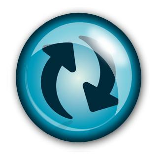



    

      <h3>On-site Consultancy</h3>
      
 The majority of our client engagements result in on-site consultancy. Co-location provides a number of benefits, the most apparent being an improvement in communication.

      
We are experienced and comfortable in client-facing situations and enjoy building healthy dialog between stakeholders. Clear communication is a pre-requisite for software which is understood, operates correctly and solves the real problem in hand. 

      
We undertake on-site consultancy on a contractual basis, typically for a fixed duration and rate.

    

    

      
    

 
#### Clients
 
We have worked with following clients
 

* Amadeus - Flight Schdule Management
* Thales UK - Unmanned Ariel Vehicle - Ground Communication module using C++
* QinetiQ - Radar Simulation using C++/OpenGL
* BNP Paribas - Consultancy work in the domain of Credit Derivatives Swaps (CDS)